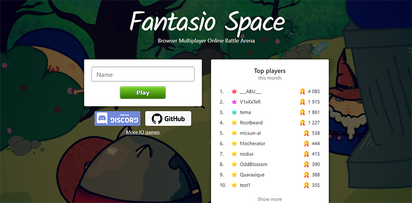

# Fantasio Space
Browser Multiplayer Online Battle Arena. Made with TypeScript, Phaser, Vue.js, Colyseus and MongoDB.

## Development
1. Install Node.js (version 14 or above) and MongoDB
2. Create ```fantasio-space``` database
3. Run ```npm install```
4. Run ```npm run dev_server``` and ```npm run dev_client```
5. Open http://localhost:1000

## Screenshots


